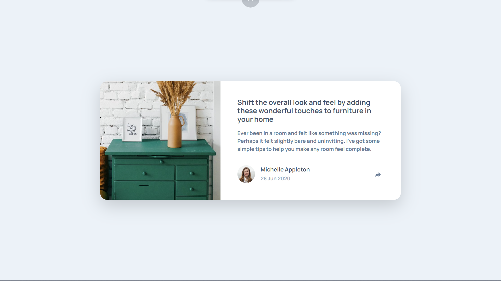

# Frontend Mentor - Article preview component solution

This is a solution to the [Article preview component challenge on Frontend Mentor](https://www.frontendmentor.io/challenges/article-preview-component-dYBN_pYFT). Frontend Mentor challenges help you improve your coding skills by building realistic projects. 

## Table of contents

- [Frontend Mentor - Article preview component solution](#frontend-mentor---article-preview-component-solution)
  - [Table of contents](#table-of-contents)
  - [Overview](#overview)
    - [The challenge](#the-challenge)
    - [Screenshot](#screenshot)
    - [Links](#links)
  - [My process](#my-process)
    - [Built with](#built-with)
    - [What I learned](#what-i-learned)
    - [Continued development](#continued-development)
  - [Author](#author)

## Overview

### The challenge

Users should be able to:

- View the optimal layout for the component depending on their device's screen size
- See the social media share links when they click the share icon

### Screenshot



### Links

- Solution URL: https://github.com/andresesaldar/FrontedMentor_ArticlePreviewComponent
- Live Site URL: https://andresesaldar.github.io/FrontedMentor_ArticlePreviewComponent

## My process

### Built with

- Semantic HTML5 markup
- CSS custom properties
- Flexbox
- [React](https://reactjs.org/) - JS library
- [Sass](https://sass-lang.com/) - CSS language
- [Bootstrap](https://sass-lang.com/) - CSS library
- [Vite](https://vitejs.dev/) - Webpack alternative

### What I learned

Sass nested rules:
```css
.btn-share
    background-color: $core-light
    & img
        @media screen and (max-width: $core-sm-size)
            filter: brightness(0) invert(1)
    &:hover
        background-color: $core-primary
        & img
            filter: brightness(0) invert(1)
    
    @media screen and (max-width: $core-sm-size)
        background-color: $core-primary !important 
        position: absolute
        right: 3rem
        top: 25%
```

Travis CI integration with github pages:
```yml
deploy:
  provider: pages
  skip_cleanup: true
  github_token: $GITHUB_TOKEN  # Set in the settings page of your repository, as a secure variable
  keep_history: true
  on:
    branch: main
```

### Continued development

The HTML elements positioning was difficult for me when I work on the share options responsive. I have to learn more about the positioning concepts on HTML/CSS.

## Author

- Github - [Andres Saldarriaga](https://github.com/andresesaldar)
- Frontend Mentor - [@andresesaldar](https://www.frontendmentor.io/profile/andresesaldar)
